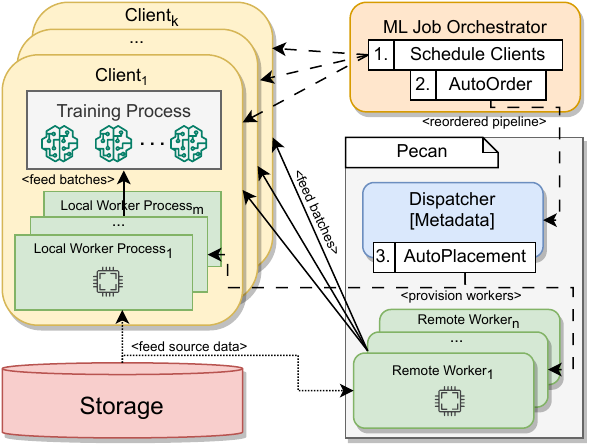
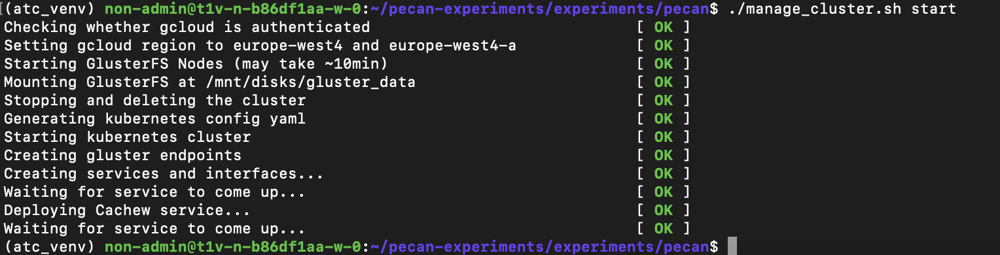

<p align="center">
  
</p>

# Pecan: Cost-Efficient ML Data Preprocessing with Automatic Transformation Ordering and Hybrid Placement

Pecan is a multi-tenant service for cost-efficient input data processing in machine learning jobs. 

To minimize end-to-end training cost, Pecan uses 2 policies: 
1) AutoPlacement, which distributes data prococessing workers between the client VM and additional remote worker nondes.
2) AutoOrder, which reorders non-critical step in the input pipeline in order to minimize the overall required CPU cycles and increase throughput.

Pecan builds on top of the [Cachew](https://www.usenix.org/system/files/atc22-graur.pdf) data loading framework in [TensorFlow](https://github.com/tensorflow/tensorflow), extending it with the AutoPlacement and AutoOrder policies.

This repository contains instructions for deploying Pecan in Google Cloud and using the service to efficiently execute ML input data pipelines. To view the source code, please see our [Pecan source code repository](https://github.com/eth-easl/cachew/tree/pecan). 

## Pecan System Architecture

Pecan consists of a centralized dispatcher, a dynamic number of remote input data workers, and a disaggregated storage cluster for data caching. For the purpose of the artifact evaluation experiments we keep all components in the `europe-west4-a` zone.

<p align="center">
  
</p>

Users register training nodes (i.e. clients) with the Pecan dispatcher. To execute an input pipeline with Pecan, clients provide a graph representation of the input pipeline and a path to the input dataset (in object storage, NFS, DFS, etc.). Pecan supports and extends the tf.data API for defining input data pipelines from a collection of composable and user-parametrizable operators.

To ensure preprocessing semantics are maintained in the context of the AutoOrder policy, users may annotate their tf.data input pipeline to mark transformations with strict dependencies using the `keep_posistion=True` flag. Otherwise Pecan can can perform any reordering in compliance with the AutoOrder policy as described in Section 5.2 of the paper.

Pecan's input data workers (remote or local) are stateless components responsible for producing batches of preprocessed data for clients. The dispatcher dynamically adjusts the number of remote and local input data workers for each job to minimize costs while keeping a minimal epoch time. The dispatcher also profiles and maintains metadata about input pipeline executions across jobs to make data caching decisions. Pecan stores cached datasets in a GlusterFS remote storage cluster. 

Clients fetch data from the workers that are assigned to them by the dispatcher. Clients and workers periodically send heartbeats to the dispatcher to maintain membership in the service and provide metrics used for the AutoPlacement (Pecan), AutoScaling and AutoCaching (Cachew) policies.

## <a name="prerequisites"/>Prerequisites

### General Prerequisites

We assume that you have access to a Linux/macOS terminal, or WSL2. Our scripts make extensive use of the `gcloud CLI` tool. As a consequence, this tool is a prerequisite for setting up VMs and running experiments. Please follow [this tutorial](https://cloud.google.com/sdk/docs/install) to install it. We additionally make use of the `gsutil` tool. To install it, please follow [this tutorial](https://cloud.google.com/storage/docs/gsutil_install). We also suggest that you use Python 3.8 when using Pecan. In this sense we recommend [PyEnv](https://github.com/pyenv/pyenv) as a means to install and manage multiple python versions and virtual environments.

### Software Prerequisites for Full Service Deployment

#### Artifact Evaluation Deployment

If you are part of the ATC'24 AE committee, please follow the next instructions (please note to always use the `europe-west4-a` GCP region):

1. Create an anonymous email, and create a GCP account on it. Then send the email to us via HotCRP so we can add you to our GCP project.
1. Once added, make sure to set the correct project in `gcloud` using `gcloud config set project`
1. Run the `./create_tpu_vm.sh <TPU_name>` to create your own TPU VM. The name of your VM is reported once the script completes. Generally it has the structure: `atc24-ae-${USER}`
1. Set up the TPU VM environment for experiments. You have two options:
  * [recommended] SSH into your VM using `gcloud alpha compute tpus tpu-vm ssh --zone europe-west4-a <your-username>@<your-VM-name>`, then run the commands in `set_up_tpu_vm_manual.sh` by hand there. In some cases dues to GCP VM PPA issues, you might need to run a command a couple of times for it to successfully complete.  
  * Run the `./create_tpu_vm.sh <your-username> <your-VM-name>` to create your own TPU VM. This has only been tested on Linux. We have occasionally observed issues with this approach. Note that `<your-username>` should **only** consist of alphanumeric characters
1. Test if you are able to successfully deploy a Pecan service: 
    1. `ssh` into your VM using `gcloud alpha compute tpus tpu-vm ssh --zone europe-west4-a atc24-ae-<TPU_name>`
    1. On the VM run the following commands:
        1. `source atc_venv/bin/activate`
        1. `cd "pecan-experiments/experiments/pecan"`
        1. `./manage_cluster.sh start  # Wait and see if the cluster is successfully deployed`
           If all goes well, you should see an output like in the image below. Otherwise the [troubleshooting section](https://github.com/eth-easl/pecan-experiments/tree/main/experiments#troubleshooting) may help you.
        1. `./manage_cluster.sh stop   # Once you are ready, use this command to take down the cluster`
1. If you can successfully execute these steps then you are ready to execute experiments. Please go to [experiments/pecan](experiments/pecan) and follow the README there.



Please ignore the *Manual Deployment* steps (not part of the Artifact Evaluation).

#### Manual Deployment

If you plan to deploy Pecan as a full service, you will need to set up a client VM which meets the following software dependencies:

* Ubuntu 20.04 LTS (GNU/Linux 5.4.0-1072-gcp x86\_64) with root access
* kubectl v1.30.0
* kops v1.19.3
* Python 3.8
* Google Cloud SDK (preferably v466.0.0)

For training models on GPUs, you will also need:

* Nvidia GPU Driver v460.27.04
* CUDA v11.2
* cuDNN v8.1

To deploy the service itself, one requires:
* A Docker image deploying Pecan builds with CPU-only support. This is used in the Pecan service for the Dispatcher and Workers
* A client-only build of Pecan with GPU/TPU support

A safe commit hash at which these can be built is `6bffdad771e7acd280b7aeba986d5fed2ff1d5f5`.

### Hardware Prerequisites for Full Service Deployment

If you plan to deploy a Full Pecan Service, you will need the following hardware for your Client VM:

* Intel or AMD x86 CPU with hardware virtualization support
* v2-8 or v3-8 TPUs
* Around 50 GB of disk space on your root partition

For the Dispatcher as well as the Worker nodes, one requires only VMs with compute power. No accelerators are required. 

### Deployment and Experiment Automation

Since deploying a cluster and running experiments can be complicated, we provide a scripts which automate these processes. For deploying a client VM you can use the [create_tpu_vm.sh](create_tpu_vm.sh) and [set_up_tpu_vm.sh](set_up_tpu_vm.sh). Scripts for running artifact evaluations are found in [experiments](experiments).

## Building Pecan

**Please note that you are not required to build Pecan or generate Docker images for it, as we have pre-built all the necessary binaries for running the artifact evaluation experiments.** We do however, provide scripts for building Pecan and generating its images. These can be found in the [build](build) folder. For more details, please follow the README file in the aforementioned directory.

## Contributing

We welcome contributions to Pecan. Please see our [Pecan source code](https://github.com/eth-easl/cachew/tree/pecan) repository.
 
## Referencing our work

Pecan will appear at USENIX ATC'24. If you decide to use Pecan in your work, please cite our paper: 

```
@inproceedings{pecan,
  author    = {Dan Graur and
               Oto Mraz and
               Muyu Li and
               Sepehr Pourghannad and
               Chandramohan A. Thekkath and
               Ana Klimovic},
  title     = {Pecan: Cost-Efficient ML Data Preprocessing with Automatic Transformation Ordering and Hybrid Placement},
  booktitle = {Proceedings of the USENIX Annual Technical Confernece (ATC'24)},
  publisher = {{USENIX}},
  year      = {2024},
}
```
