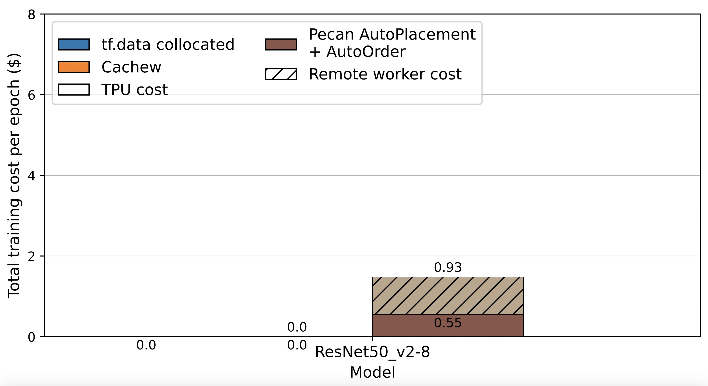

Figure 8: Collocated vs. Cachew vs. Pecan
=======

All commands below are intended to be executed on the remote TPU VM as deployed via the `create_tpu_vm.sh` script. If you have not already done so, `ssh` into it using `gcloud alpha compute tpus tpu-vm ssh --zone europe-west4-a atc24-ae-<TPU_name>`

### Kick-the-tires and ResNet

For the initial `kick-the-tires` phase please go through steps 1-6 ("Getting Started" example). For the `full evaluation` of the ResNet experiment, please complete steps.

1. **Activate tmux window**. Since some of our experiments can take long to run, make sure to set up a terminal multiplexer such as `tmux` in case your connection is interrupted. A very short introduction can be found at the end of this readme.
2. **Activate the Artifact Eval virtual environment** `source ~/atc_venv/bin/activate`
3. **Go to the experiments directory** `cd ~/pecan-experiments/experiments/pecan`
4. **Starting the cluster**. Execute `./manage_cluster.sh start`. The script will create and setup a cluster of several virtual machines.
5. **Checking the status** of the cluster by executing `./manage_cluster.sh status`. If all the status indicators show a green `[OK]`, carry on with the next step.
6. **Run Hellow World example**. Run the following command to execute a short ResNet run to check the setup is working correctly. `python run_fig8.py -m short` In this run, all workers are used at all times and a single bar is produced in the plot `plots/Getting_started.pdf` (see our Reference Results below and the sample log file `logs/sample_logs/hello_world.log`).
7. **Run ResNet50 experiment**. Start up the cluster again (steps 4. and 5.). Run the following command to execute the experiments for the ResNet in Fig 8. `python run_fig8.py -m ResNet50_v2-8`. More concretely this script does the following:
    a. **Run the input pipeline with Pecan** - producing data for the brown bars
    b. **Run the input pipeline with Cachew** - producing data for the orange bars
    c. **Run the pipeline in the collocated mode** - producing data for the blue bars
    d. **Generate a plot with the cost of each config** - generating a plot `plots/fig8_ResNet50_v2-8.pdf`

### RetinaNet

Due to the way in which the RetinaNet model was constructed, it must be run dirrectly from the terminal (otherwise it will hang). Hence please do not use tmux for these experiments.

1. **Activate the Artifact Eval virtual environment** `source ~/atc_venv/bin/activate`
2. **Go to the experiments directory** `cd ~/pecan-experiments/experiments/pecan`
3. **Starting the cluster**. Execute `./manage_cluster.sh start`. The script will create and setup a cluster of several virtual machines.
4. **Checking the status** of the cluster by executing `./manage_cluster.sh status`. If all the status indicators show a green `[OK]`, carry on with the next step.
5. **Run RetinaNet experiment**. Use `nohup python run_fig8.py -m retina > output.log 2>&1 &` More concretely this script does the following:
    a. **Run the input pipeline with Pecan** - producing data for the brown bars
    b. **Run the input pipeline with Cachew** - producing data for the orange bars
    c. **Run the pipeline in the collocated mode** - producing data for the blue bars
    d. **Generate a plot with the cost of each config** - generating a plot `plots/RetinaNet.pdf`

You are free close the window now. When you come back to check, check that the `run_fig8.py` script has finished. If you run `ps -aux | grep run_fig8` there should be no entry corresponding to the script. You can then find the plot in `plots/RetinaNet.pdf`.

We use Google Cloud Compute Engine for all experiments and read input datasets from Google Cloud Storage buckets. Please see [this](https://docs.google.com/spreadsheets/d/1iwkurV_3AxQ7a_KcKKhgDBbO5r0rSQZxcjTqwgxE9Mg/edit?usp=sharing) spreadsheet for an estimate of the time and cost of running each of the above experiments.

*How to use `tmux`*: Execute `tmux` in the current directory. Then whatever command you want to execute in the background (i.e. `./experiment_fig7.sh`). You may now close this window by actually closing the terminal itself, **do not use `Ctrl+C` / `Ctrl+D`**. If at a later point you would like to check in on the experiment, ssh into your machine and execute `tmux attach -t 0` (tmux supports multiple of those "background sessions", so if you have multiple open sessions, you may be looking for an integer larger than `0`). In general you may want to interact with `tmux` using [keyboard shortcuts](https://gist.github.com/MohamedAlaa/2961058).

### Reference Results and Variability

This experiment runs Cachew's AutoScaling and Pecan's AutoOrder & AutoPlacement policices. Both AutoScaling & AutoPlacement rely on (somewhat noisy) runtime metrics. The permormance is also impacted by the current load in Google Cloud. Hence it is expected to observe some variability in the exact costs of Cachew and Pecan, especially in the ResNet experiment which uses many workers.

**The key result here is that Pecan incurrs a significantly lower cost than collocated or Cachew setups.**

Below we offer the reference results:

Hello World experiment:

ResNet experiment (2 versions of possible results):

RetinaNet experiment:

See also the `logs/sample_logs` directory for example logs of the experimentss